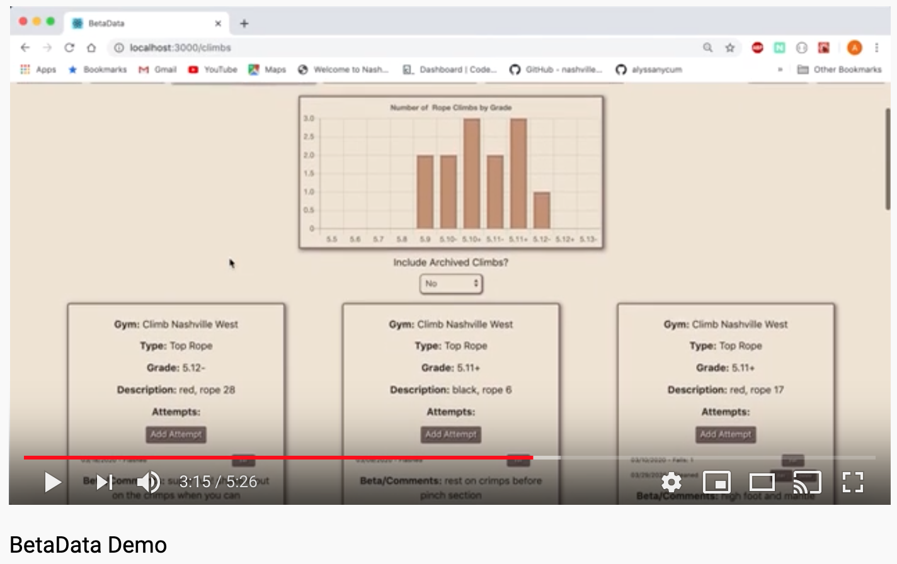

# BetaData

## Why was it created?

Don't you hate when you're in the middle of a climb and suddenly remember that you've done this climb before and you hated it? Or you can't remember if you've cleaned a climb yet or not? Or you wish you would have remembered the beta that got you through a climb the first time? Betadata has you covered! 

## What is it?

BetaData  is  a rock climbing app where gym climbers can record the climbs they've done. You can add multiple attempts to each climb, record when you've gotten it clean, add a comment to remind yourself of helpful beta, and add a rating of how much you enjoyed it. You also have the ability to see all the climbs you've done in a helpful graph so you can use that data to push yourself to climb the next hardest grade. There is also a section where you can record climbing goals that you have for yourself. 

## Technologies Used

* HTML5
* CSS3
* Javascript
* [React](https://reactjs.org/)
* [Reactstrap](https://reactstrap.github.io/)
* [Moment.js](https://momentjs.com/)
* [Chart.js](https://www.chartjs.org/)

## Installations to Test Locally

1. git clone this repo in your terminal
```shell session
$ git clone git@github.com:alyssanycum/betadata.git
```

2. Install all libraries and their dependencies
```shell session
$ npm install
```

3. In the root directory, create an api directory and a database.json file in tht directory
```shell session
$ mkdir api
$ cd api
$ touch database.json
```
4. Start your json-server on port 5002
```shell session
$ json-server -p 5002 -w database.json
```

5. Open a new tab in your terminal, cd back to the root directory, and run npm start
```shell session
$ ..
$ npm start
```

6. Open another new tab in your terminal and open the code in your preferred code editor
```shell session
$ code .
```

7. Open the database.json file and paste the following:
```json
{
    "users": [],
    "climbs":[],
    "attempts": [],
    "gyms": [],
    "goals": [],
}
```

8. Go to http://localhost:3000/ in your browser to see BetaData

9. Watch the video below to learn how to use BetaData!

## Demo

<a href="http://www.youtube.com/watch?feature=player_embedded&v=ZF6rTXsdgG0
" target="_blank"></a>

